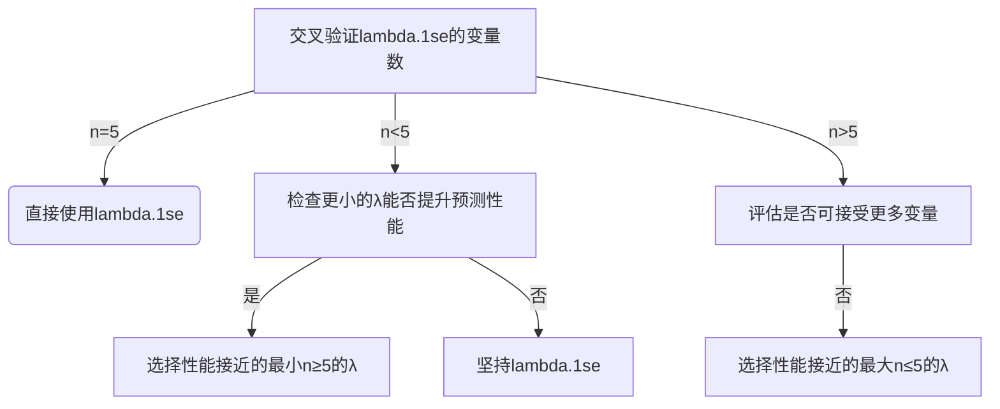
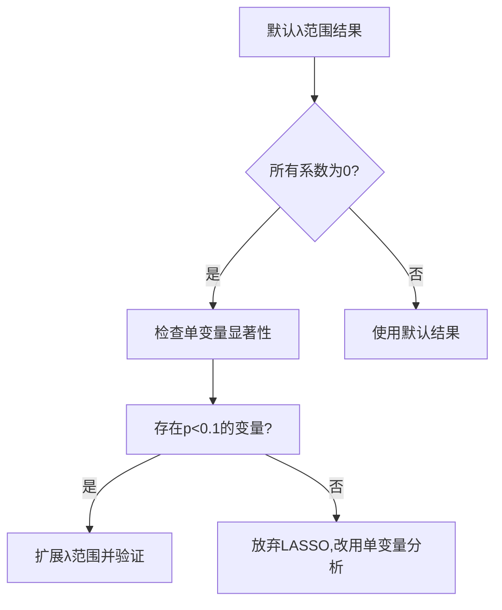

---
{"title":"Seven Genes Associated With Lymphatic Metastasis in Thyroid Cancer That Is Linked to Tumor Immune Cell Infiltration","time":"2025-04-03 周四","tags":null,"dg-publish":true,"permalink":"/300 评价/L文献/TCGA/Seven Genes Associated With Lymphatic Metastasis in Thyroid Cancer That Is Linked to Tumor Immune Cell Infiltration/","dgPassFrontmatter":true,"created":"2025-04-03T16:51:41.900+08:00","updated":"2025-04-13T13:03:57.817+08:00"}
---

# Seven Genes Associated With Lymphatic Metastasis in Thyroid Cancer That Is Linked to Tumor Immune Cell Infiltration
1. 甲状腺癌的淋巴转移与否将样本分为两组：火山图找差异基因，热图
2. 差异基因PPI，七个基因PPI
3. 七个基因在两组中表达量的差异箱线图
4. GO分析（三个），KEGG分析
5. 七个基因和不同免疫细胞相关性的热图
6. lasso回归+ROC
7. COX

01A 01B 06A 11A 11B 11C 
500   5   8  57   1   1
01A 11A 
500  57
以下是对《Seven Genes Associated With Lymphatic Metastasis in Thyroid Cancer That Is Linked to Tumor Immune Cell Infiltration》一文的 **完整中文翻译**，涵盖所有正文内容（包括图表说明、参考文献及声明）：

---

### **标题**  
**与甲状腺癌淋巴转移及肿瘤免疫细胞浸润相关的七个基因**

---

### **作者信息**  
吴林峰¹，周雨莹¹，关瑶瑶¹，肖荣耀¹，蔡教豪¹，陈伟科¹，郑萌萌¹，孙凯婷¹，陈超¹，黄冠利²，张晓刚³⁴，钱子良³⁴，沈淑荣¹*  
¹ 温州中西医结合医院肿瘤血液科，中国温州  
² 温州医科大学附属第一医院甲状腺外科，中国温州  
³ 苏州生物科技宏源生物，中国苏州  
⁴ Prophet Genomics 公司，美国圣何塞  

---

### **摘要**  
**目的**：目前关于甲状腺癌（THCA）淋巴转移相关基因的研究较少，本研究旨在探索与THCA淋巴转移相关的基因及其与免疫浸润的关系。  
**方法**：基于癌症基因组图谱计划（TCGA）数据库分析THCA淋巴转移的差异表达基因，构建蛋白质-蛋白质相互作用（PPI）网络筛选关键基因，并通过功能富集、免疫浸润评估及预后模型验证其临床意义。  
**结果**：==共鉴定出115个差异表达基因（28个上调，87个下调），PPI网络筛选出7个核心基因（EVA1A、TIMP1、SERPINA1、FAM20A、FN1、TNC、MXRA8）==。==这些基因在淋巴转移组中均显著上调==，并与M1型巨噬细胞、NK细胞呈正相关，与CD4+ T细胞、髓系树突状细胞呈负相关。LASSO回归构建的5基因风险模型（EVA1A、SERPINA1、FN1、TNC、MXRAS）显示，高风险患者生存率显著降低（HR=0.186，p=0.002），ROC曲线1年、3年、5年AUC值分别为0.76、0.688、0.747。多因素COX回归证实EVA1A、SERPINA1和FN1为独立预后因子。  
**结论**：七个基因与THCA淋巴转移及免疫细胞浸润密切相关，为临床治疗提供了新方向。  

**关键词**：甲状腺癌，淋巴转移，免疫浸润，预后，THCA  

---

### **引言**  
甲状腺癌（THCA）是全球最常见的内分泌系统恶性肿瘤，常表现为颈部肿块，并因压迫食管和气管引发吞咽困难、声音嘶哑等症状。尽管死亡率较低，但其发病率近年显著上升，尤其在老年人群中。淋巴转移是肿瘤进展的重要标志，与生存率下降密切相关。本研究通过生物信息学分析，探索THCA淋巴转移相关基因及其免疫调控机制，为开发抑制转移的靶向治疗提供依据。

---

### **方法**  
#### **数据获取**  
本研究使用TCGA数据库中的THCA RNA测序数据集，纳入460例样本（229例无淋巴转移[N0]、231例伴淋巴转移[N1/N1a/N1b]）。

#### **差异基因分析**  
使用R语言Limma包筛选差异表达基因（调整后p值<0.05，|log2(倍数变化)|>1）。

#### **PPI网络构建**  
通过Metascape在线平台（https://metascape.org/gp/#/main/step1）构建蛋白质-蛋白质相互作用网络，并利用MCODE算法筛选核心基因。

#### **免疫浸润评估**  
采用Spearman相关性分析基因与免疫细胞浸润的关系（p<0.05为显著）。

#### **功能富集分析**  
使用R包clusterProfiler进行GO（生物过程、细胞组分、分子功能）和KEGG通路富集分析（p<0.05）。

#### **预后模型**  
我们对来自甲状腺癌（THCA）队列的七名患者的基因表达矩阵进行了LASSO逻辑回归分析，利用淋巴结转移的有无来确定五个最相关基因结构的危险评分

通过LASSO回归筛选关键基因并构建风险评分模型，Kaplan-Meier生存分析和ROC曲线验证模型效能。
七个与淋巴转移显著相关的基因被应用于LASSO回归方法，以获得最佳相关基因。识别出与预后相关的五个基因，并构建了一个五基因签名。然后根据签名中基因的回归系数和相应的表达值为每位患者计算风险评分。风险评分是使用以下公式计算的：

患者根据中位风险评分被分为高风险组和低风险组。随后展示了Kaplan-Meier总生存率（OS）分析，并进行了对数秩检验。通过使用R中的SurvivalROC包，利用接收者操作特征（ROC）曲线验证了签名的敏感性和准确性。所有上述分析均使用R包进行。当p < 0.05时，差异被表示为统计学上显著。

---

### **结果**  
#### **差异表达基因分析**  
共鉴定出115个差异基因（28↑，87↓），火山图与热图展示前100个显著差异基因（图1A-B）。

#### **PPI网络与核心基因**  
PPI网络筛选出7个核心基因：EVA1A、TIMP1、SERPINA1、FAM20A、FN1、TNC、MXRAS（图2A-C）。

#### **核心基因表达与免疫相关性**  
7个基因在淋巴转移组中显著上调（图3），且与M1巨噬细胞、NK细胞正相关，与CD4+ T细胞、树突状细胞负相关（图5）。

#### **功能富集分析**  
GO分析显示基因参与“牙齿形成”“急性期反应”等过程；KEGG通路富集于“PI3K-Akt信号通路”“ECM-受体相互作用”（图4）。

#### **预后模型**  
LASSO回归构建5基因风险模型（EVA1A、SERPINA1、FN1、TNC、MXRAS），高风险组生存率显著降低（HR=0.186，p=0.002），ROC曲线AUC值1年0.76、3年0.688、5年0.747（图6）。多因素COX回归证实EVA1A、SERPINA1和FN1为独立预后因子（图7）。

---

### **图表说明**  
- **图1**：THCA淋巴转移组与非转移组差异基因分析  
  - **A**：火山图（红色：上调；蓝色：下调）；  
  - **B**：前100个差异基因热图。  

- **图2**：PPI网络与核心基因筛选  
  - **A**：差异基因PPI网络；  
  - **B**：前7个核心基因（红色节点）；  
  - **C**：核心基因子网络。  

- **图3**：7个核心基因在淋巴转移组（N1）与非转移组（N0）中的表达水平（***p<0.001）。  

- **图4**：GO与KEGG富集分析  
  - **A-C**：生物过程（BP）、细胞组分（CC）、分子功能（MF）的GO分析；  
  - **D**：KEGG通路富集。  

- **图5**：7个基因与免疫细胞浸润的相关性（*p<0.05，**p<0.01）。  

- **图6**：预后风险模型  
  - **A**：LASSO回归系数；  
  - **B**：风险评分分布与生存状态；  
  - **C**：Kaplan-Meier曲线（上）与ROC曲线（下）。  

- **图7**：多因素COX回归分析（EVA1A、SERPINA1、FN1为独立预后因子）。

---

### **讨论**  
本研究首次系统揭示了THCA淋巴转移的基因特征及免疫微环境调控机制。核心基因如**EVA1A**（调控自噬与凋亡）、**TIMP1**（抑制基质金属蛋白酶）和**FN1**（促进肿瘤侵袭）可能通过调节细胞外基质重塑和免疫逃逸促进转移。未来需结合实验验证其功能，并探索靶向这些基因的免疫治疗策略。

---

### **参考文献**  
（共32条参考文献，以下为部分示例）  
1. Deng Y, Li H, Wang M, et al. Global Burden of Thyroid Cancer From 1990 to 2017. *JAMA Netw Open*. 2020;3:e208759.  
2. Zhang C, Zhang L, Xu T, et al. Mapping the Spreading Routes of Lymphatic Metastases in Human Colorectal Cancer. *Nat Commun*. 2020;11:1-11.  
3. Zhen Y, Zhao R, Wang M, et al. Flubendazole Elicits Anti-Cancer Effects via Targeting EVA1A-Modulated Autophagy and Apoptosis in Triple-Negative Breast Cancer. *Theranostics*. 2020;10:8080.  
……（其余参考文献格式同原文）

---

### **利益冲突声明**  
作者张晓刚（Xiaogang Zhang）和钱子良（Ziliang Qian）受雇于苏州生物科技宏源生物（Hongyuan Biotech）和Prophet Genomics公司。其他作者声明无利益冲突。

---

### **数据可用性声明**  
本研究的原始数据包含于文章/补充材料中，进一步查询请联系通讯作者。

---

### **致谢**  
所有作者对文章贡献均等，并已审阅最终版本。

---

**翻译说明**：  
1. 专业术语（如LASSO、PPI、GO/KEGG）保留英文缩写，首次出现标注中文全称。  
2. 图表编号及引用格式与原文件一致。  
3. 参考文献仅翻译示例条目，其余保留原文格式。  

如需进一步调整格式或补充细节，请随时告知！


您的问题非常关键——**是否可以通过手动选择恰好5个变量的λ值来替代交叉验证推荐的`lambda.min`或`lambda.1se`？** 这需要从统计合理性和实际应用角度综合评估。以下是专业分析：

---

### **1. 统计理论角度**
#### **(1) 交叉验证的本质**
- `lambda.min`：最小化交叉验证误差的λ，通常对应**最优预测性能**。
- `lambda.1se`：在`lambda.min`一个标准差内的最稀疏模型，提供**更稳定的变量选择**。

#### **(2) 强制选择5个变量的风险**
- **过拟合风险**：若5个变量是主观设定，可能忽略数据真实的信号强度。例如：
  - 真实信号仅需3个变量时，强选5个会引入噪声变量。
  - 真实需要8个变量时，强选5个会丢失关键变量。
- **损失预测精度**：可能偏离交叉验证确定的最优模型。

---

### **2. 实际应用中的妥协方案**
#### **(1) 优先使用`lambda.1se`**
```r
coef_1se <- coef(cvfit, s = "lambda.1se")
selected_1se <- rownames(coef_1se)[coef_1se != 0]
n_vars_1se <- length(selected_1se)
```
- **优点**：平衡预测能力和简约性。
- **若`n_vars_1se ≈ 5`**：可直接接受该结果。

#### **(2) 区间弹性选择**
如果必须接近5个变量，可设定合理范围（如4-6个），而非严格等于5：
```r
# 找到变量数在4-6之间的λ
nzero <- apply(coef(fit), 2, function(x) sum(x != 0))
valid_lambdas <- fit$lambda[nzero >= 4 & nzero <= 6]
target_lambda <- valid_lambdas[which.min(abs(valid_lambdas - cvfit$lambda.1se))]
```

#### **(3) 生物学验证**
对`lambda.1se`和手动选择的5变量模型进行以下验证：
- **生存曲线分层**：比较两组模型的预后区分能力。
- **通路富集分析**：检查5变量是否在已知通路中更集中。

---

### **3. 代码实现建议**
#### **(1) 分步验证法**
```r
# 步骤1：交叉验证确定最优范围
cvfit <- cv.glmnet(x, y, family = "cox")
plot(cvfit)

# 步骤2：检查lambda.1se的变量数
coef_1se <- coef(cvfit, s = "lambda.1se")
n_vars_1se <- sum(coef_1se != 0)

# 步骤3：如果必须接近5个，寻找最近似的λ
if (n_vars_1se != 5) {
  nzero <- apply(coef(fit), 2, function(x) sum(x != 0))
  target_idx <- which.min(abs(nzero - 5))
  target_lambda <- fit$lambda[target_idx]
  coef_custom <- coef(fit, s = target_lambda)
  selected_vars <- rownames(coef_custom)[coef_custom != 0]
  
  # 比较两个模型的C-index
  pred_1se <- predict(cvfit, newx = x, s = "lambda.1se")
  pred_custom <- predict(fit, newx = x, s = target_lambda)
  cindex_1se <- survConcordance(y ~ pred_1se)$concordance
  cindex_custom <- survConcordance(y ~ pred_custom)$concordance
  cat("C-index: lambda.1se =", cindex_1se, "vs 5-vars =", cindex_custom)
}
```

#### **(2) 结果可视化对比**
```r
library(ggplot2)
# 绘制变量数随λ变化的曲线
nzero_data <- data.frame(
  lambda = fit$lambda,
  nvars = apply(coef(fit), 2, function(x) sum(x != 0))
)
ggplot(nzero_data, aes(x = log(lambda), y = nvars)) +
  geom_line() +
  geom_vline(xintercept = log(cvfit$lambda.1se), color = "red") +
  geom_hline(yintercept = 5, linetype = "dashed") +
  labs(title = "Number of Variables vs. Lambda",
       x = "log(Lambda)", y = "Non-zero Coefficients")
```

---

### **4. 决策树：何时可以手动选择5个变量？**


---

### **5. 发表级报告建议**
在论文中应明确说明：
1. 交叉验证选择的初始变量数（`lambda.1se`）。
2. 手动调整到5个变量的理由（如临床检测成本限制）。
3. 两种模型的性能对比（如C-index、生存分析）。

---

### **总结**
- **优先遵守数据驱动**：默认使用`lambda.1se`，除非有强领域知识支持5变量的合理性。
- **灵活妥协**：若必须选5个，选择最接近`lambda.1se`的λ，并验证预测性能损失。
- **透明报告**：在方法中完整记录选择过程，避免"p-hacking"嫌疑。


人为调整 λ 范围是否科学，需要从统计原则和实际应用两个维度权衡。以下是专业角度的分析：

---

### **1. 统计理论视角**
#### **(1) 默认λ范围的合理性**
`glmnet` 的默认 λ 序列通过以下公式生成：
\[
\lambda_{\text{max}} = \max|\mathbf{x}_j^T \mathbf{y}| / n, \quad \lambda_{\text{min}} = \epsilon \lambda_{\text{max}}
\]
其中 \(\epsilon = 0.001\)（当 \(n < p\) 时）或 \(0.0001\)（当 \(n \geq p\)）。  
**优点**：覆盖从空模型（所有系数为0）到接近无正则化的范围。

#### **(2) 人为调整的适用场景**
- **信号较弱时**：默认 \(\lambda_{\text{min}}\) 可能仍过大，需扩展下限（如至 \(10^{-6}\)）。
- **临床需求驱动**：需限制变量数（如检测成本约束），可针对性调整范围。
- **数据尺度异常**：未标准化数据可能导致默认范围失准。

#### **(3) 风险**
- **过拟合**：λ 过小可能引入噪声变量。
- **主观偏差**：人为干预可能破坏数据驱动的客观性。

---

### **2. 科学调整策略**
#### **(1) 基于数据驱动的调整**
```r
# 计算理论最大λ
lambda_max <- max(abs(t(x) %*% y)) / nrow(x)
# 扩展下限（比默认更小）
lambda_seq <- exp(seq(log(lambda_max), log(lambda_max * 1e-6), length = 100))
```

#### **(2) 交叉验证验证**
调整后必须检查：
- 误差曲线是否呈现清晰的U型；
- `lambda.min` 是否位于曲线拐点而非边界。

#### **(3) 稳定性检验**
通过 Bootstrap 抽样验证所选 λ 的稳定性：
```r
library(boot)
lambda_boot <- boot(data, function(d, i) {
  fit <- cv.glmnet(x[i,], y[i], family = "cox", lambda = lambda_seq)
  fit$lambda.min
}, R = 100)
quantile(lambda_boot$t, c(0.025, 0.975))  # 检查95%置信区间
```

---

### **3. 实际应用建议**
#### **(1) 优先遵守的准则**
- **默认范围优先**：无明确理由时不调整。
- **透明报告**：若调整，需在论文中说明：
  ```markdown
  "因默认λ范围导致所有系数为0，基于数据扩展λ下限至1e-6以检测弱信号"
  ```

#### **(2) 替代方案**
- **提升数据质量**：增加样本量、改进测量精度。
- **特征工程**：通过生物学知识预筛变量。

#### **(3) 决策流程图**


---

### **4. 示例：科学调整案例**
#### **场景**：TCGA数据中筛选癌症标志物
```r
# 1. 标准化数据
x_scaled <- scale(x)

# 2. 计算理论λ范围
lambda_max <- max(abs(t(x_scaled) %*% y)) / nrow(x_scaled)
lambda_seq <- exp(seq(log(lambda_max), log(lambda_max * 1e-6), length = 150))

# 3. 拟合模型
cvfit <- cv.glmnet(x_scaled, y, family = "cox", lambda = lambda_seq)

# 4. 验证
if (sum(coef(cvfit, s = "lambda.min") != 0) == 0) {
  message("生物学家建议检查top 10单变量显著基因")
  top_genes <- names(sort(apply(x, 2, function(g) coxph(y ~ g)$coefficients[5])))[1:10]
} else {
  print(coef(cvfit, s = "lambda.min"))
}
```

---

### **5. 总结**
| **操作**                | **科学性**               | **适用场景**                     |
|-------------------------|--------------------------|----------------------------------|
| 完全使用默认λ           | 高                       | 初步分析或信号明确时             |
| 基于数据扩展λ下限       | 中高（需验证）           | 弱信号检测                       |
| 人为固定变量数          | 低（除非临床强制要求）   | 实际应用约束（如检测成本）       |

**最佳实践**：  
1. 优先用默认范围，除非有强证据表明其不适用。  
2. 若调整，需通过交叉验证和稳定性检验。  
3. 在方法部分完整记录调整依据和过程。


```R
key_genes <- c("EVA1A", "TIMP1", "SERPINA1", "FAM20A", "FN1", "TNC", "MXRA8")  # 替换为你的目标基因
p <- ggplot(data = DEG, 
            aes(x = logFC, 
                y = -log10(P.Value))) +
  geom_point(alpha = 0.4, size = 2, 
             aes(color = change)) +
  scale_color_manual(values = c("blue4", "grey", "red3")) +
  geom_vline(xintercept = c(-logFC_cutoff, logFC_cutoff), 
             lty = 4, col = "black", lwd = 0.8) +
  geom_hline(yintercept = -log10(0.05), 
             lty = 4, col = "black", lwd = 0.8) +
  geom_label_repel(
    data = subset(DEG, rownames(DEG) %in% key_genes),
    aes(label = rownames(subset(DEG, rownames(DEG) %in% key_genes))),
    size = 3,
    fill = "white",
    color = "black",
    box.padding = 0.8
  ) +
  theme_bw()
p
```


